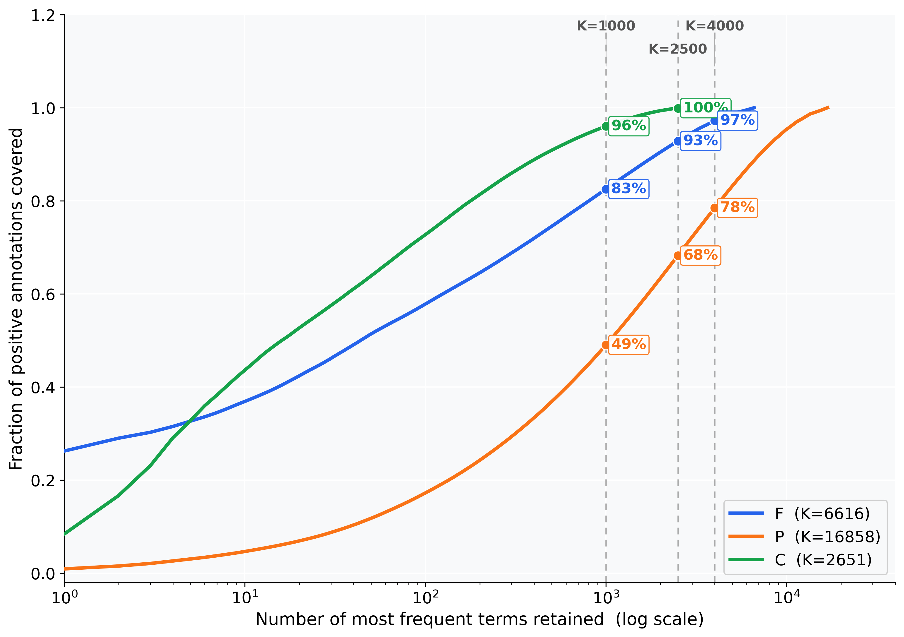
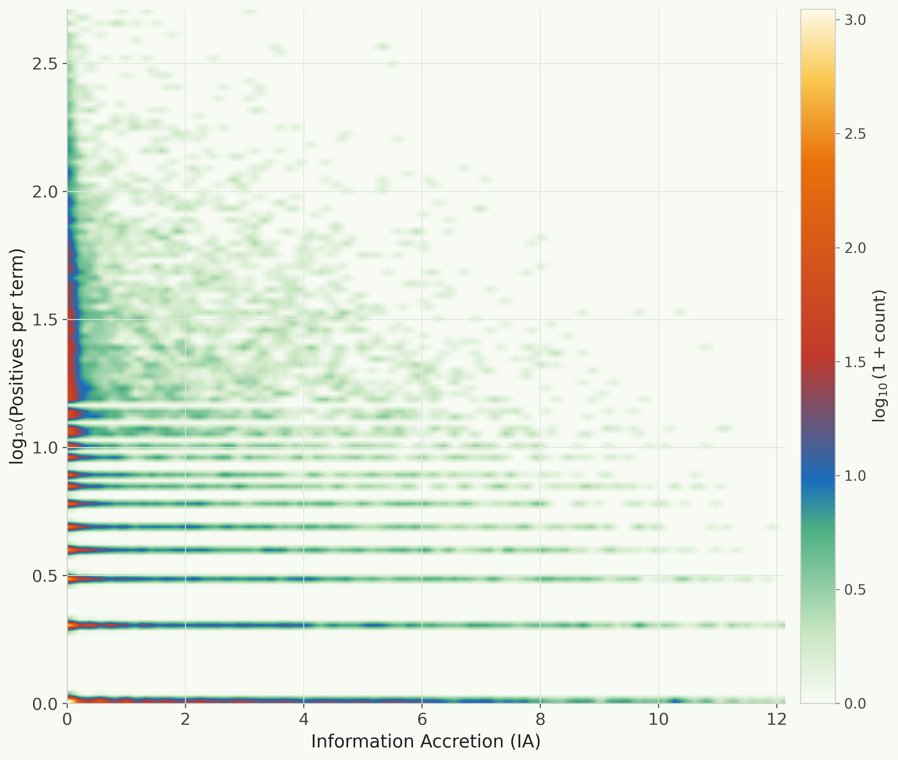
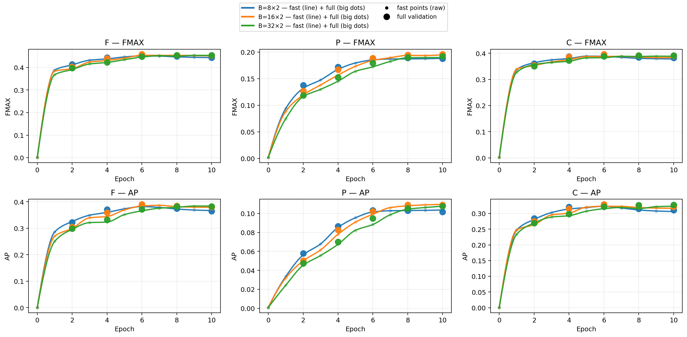
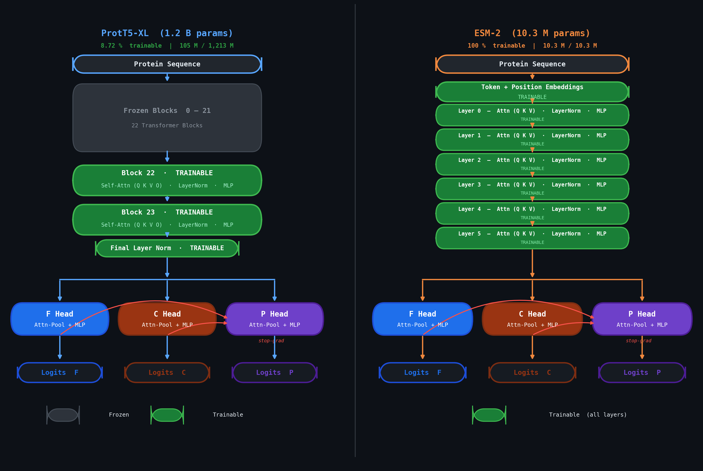
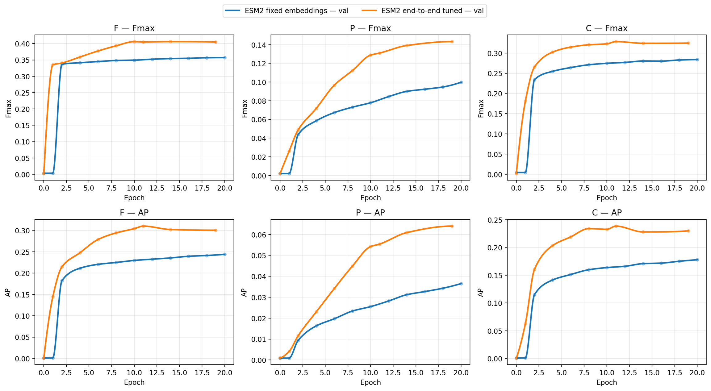
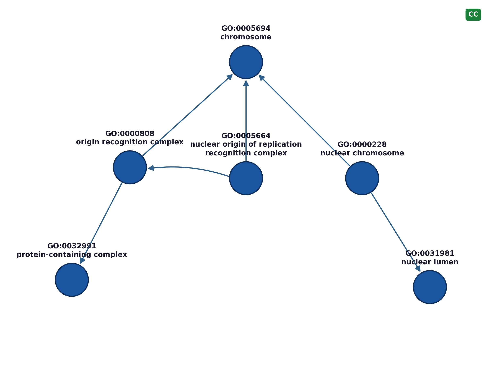
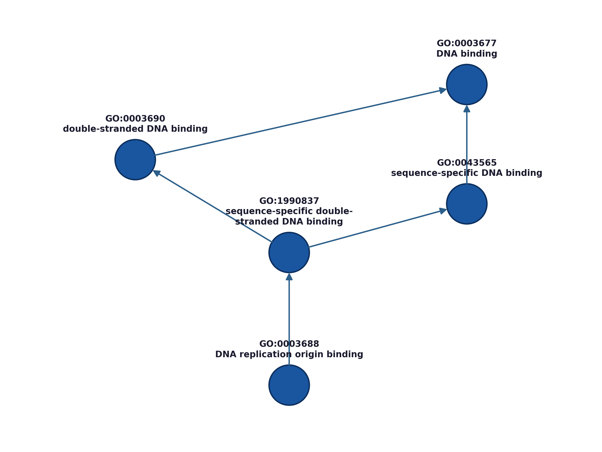
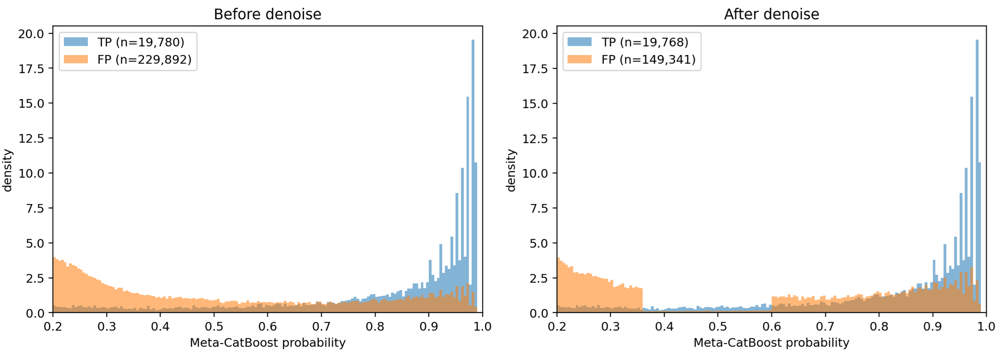

<h2 align="center">
Transformer-Based Deep Learning for Protein Function Prediction: 
Experiments from the CAFA-6 Challenge
</h2>

<strong>Vahe Sokhoyan</strong> 
March 2026

# Overview

Predicting protein function from amino-acid sequence remains a central problem in computational biology. This study presents a systematic Machine Learning-based protein function prediction pipeline developed for the Critical Assessment of Functional Annotation 6 (CAFA-6) challenge hosted on Google Kaggle. The pipeline addresses extreme class imbalance and highly variable label frequency across Gene Ontology (GO) annotations spanning three orders of magnitude. Fixed-embedding approaches using extracted ProtT5-XL and ESM2 representations were systematically compared with end-to-end fine-tuned transformer architectures with partially or fully unfrozen internal layers, across multiple experimental settings. Additional aggregation and post-processing procedures were developed to account for the statistical structure of ensemble predictions beyond conventional mean or median aggregation across K-fold ensembles. At the post-processing stage, the hierarchical structure of the GO directed acyclic graph (GO-DAG) was exploited to recover biologically consistent functional annotations not directly identified by the ML models. Finally, a reference-guided denoising attempt using the UniProt/GOA database was performed and analyzed, revealing a systematic validation-leaderboard transfer gap with identified structural causes.

**Key aspects studied:**

- Fixed-embedding and end-to-end fine-tuned transformer architectures using ProtT5-XL (~3B parameters and ~1.2B parameters for the encode-only variant) and smaller ESM2 variants were systematically compared across multiple experimental settings, including large-scale GPU experimentation on NVIDIA A100 and AMD MI300X accelerators.
- An asymmetric neural architecture was designed leveraging the biological structure of the Gene Ontology: Molecular Function (MF) and Cellular Component (CC) representations inform Biological Process (BP) predictions without reverse information flow, improving BP performance while preserving MF and CC quality.
- The training dynamics was studied separately for labels spanning three orders of magnitude in frequency, revealing that the low-frequency tail continues to improve beyond the point where global validation metrics enter a regime of diminishing returns.
- Following identification of a strongly fold-sparse signal structure, an Information Accretion (IA)-aware ensemble aggregation strategy was developed, outperforming conventional mean and median aggregation by preserving rare-term signal that would otherwise be suppressed.
- GO-DAG propagation was applied as a biologically informed post-processing step, illustrated through GO-DAG-based plots of representative predicted terms.
- A reference-guided denoising strategy using UniProt/GOA evidence was developed and evaluated, demonstrating effective false-positive suppression on validation data while exposing the structural reasons for limited leaderboard transfer, including reference coverage mismatch, domain shift, and metric sensitivity effects.

---

**Keywords:** transformer fine-tuning, multi-label learning, extreme label imbalance, ensemble learning, ontology-aware machine learning, systematic experimentation, GPU-scale deep learning

# Data

## Data and Challenge Context

The Critical Assessment of Functional Annotation (CAFA-6) challenge evaluates computational methods for predicting protein function from amino-acid sequence. The dataset comprises approximately 82,000 training proteins with Gene Ontology (GO) annotations across three functional aspects: Molecular Function (MF), covering biochemical activities such as enzyme catalysis and binding; Biological Process (BP), covering biological pathways and systems-level functions, and Cellular Component (CC), covering subcellular localization. Performance is measured using the information accretion-weighted F-measure (Fmax), which accounts for both prediction accuracy and ontological specificity. Test evaluation is prospective, applied to proteins that were initially unannotated.

  
  

<em><b>Figure 1.</b> Left: Cumulative annotation coverage versus retained terms (top-K). Right: Term specificity (IA) versus frequency.</em>

**Key data characteristics**

GO annotations follow a pronounced long-tail distribution (Fig. 1, left). A small subset of frequent terms accounts for the majority of annotations, while thousands of specific terms occur rarely. For the Biological Process ontology, approximately 2000 terms cover 80–85% of all annotations, yet the full ontology contains over 15,000 terms. Higher information accretion (IA) terms, encoding more specific biological functions, systematically occur at lower frequencies (Fig. 1, right), creating a direct coupling between term specificity and data sparsity.

This structure has concrete consequences for model design. Standard mean or median ensemble aggregation suppresses signal from rare but biologically relevant predictions. Global validation metrics are dominated by frequent terms and may obscure training dynamics in the rare-label tail. These observations directly motivated the asymmetric architecture design, IA-aware ensemble aggregation, and GO-DAG post-processing described in subsequent sections.

### Training Machine Learning models: Fixed embeddings vs. end-to-end transformer fine-tuning with unfrozen layers

One of the main aspects studied in this work is whether protein function prediction for the CAFA-6 task is best addressed using fixed transformer embeddings with downstream classifiers or by end-to-end fine-tuning of the transformer backbone. Both approaches were investigated systematically using the ProtT5-XL protein language model and, in a separate comparison, the ESM2 architecture. These aspects were already studied in existing literature for various transformer configurations. Here the study is performed specifically for selected hyperparameter combinations, comparisons are performed for K-fold analysis and also for individual ontologies for Fmax and average precision (AP).

In the fixed-embedding configuration, protein sequences are first encoded by the pretrained transformer model, and the resulting sequence representations are treated as frozen inputs to task-specific classification heads containing Multilayer perceptron (MLP) and attention layers. This approach is computationally efficient and widely used in bioinformatics applications, since the computationally heavy transformer inference step is performed only once and the downstream optimization is restricted to lightweight neural layers. In the end-to-end configuration, the internal transformer representation is allowed to adapt to the downstream task by unfreezing selected transformer layers or the entire transformer (more practical for smaller models) during training. In the ProtT5 configuration used here, the last two transformer blocks were unfrozen, while the earlier blocks remained frozen to preserve the pretrained representation and reduce computational cost.

---

  
  

<em>Figure 2. Model architecture used for protein function prediction. Left: multi-head prediction architecture operating in this example on fixed ProtT5 embeddings. Right: End-to-end fine-tuning scheme with the final transformer blocks of ProtT5 unfrozen and frozen earlier layers. In both cases the sequence representation is processed by attention layers followed by ontology-specific MLP heads for MF, BP, and CC ontologies.</em>

A key architectural component is the asymmetric coupling between ontology heads shown in Fig. 2 (left). The predictions for MF and CC ontologies are fed into the BP ontology branch through learned projection layers. However, the reverse direction is blocked by a stop-gradient operation. Empirically, experiments (not included here) demonstrated that the BP ontology benefits from additional contextual information derived from MF and CC predictions, whereas introducing symmetric connections in several experiments degraded performance for MF and CC. This asymmetric design therefore reflects both the statistical structure of the dataset and the biological assumption that biological processes may often depend on molecular functions and cellular localization. Figure 3 shows the results for Fmax and AP for MF, BP, and CC for the fixed-embedding configuration, serving as a baseline for all subsequent experiments with the end-to-end transformer fine-tuning. In this setup, ProtT5 embeddings are computed once for each sequence and the classification heads are trained independently. Across all three ontologies the five folds show highly consistent training behavior, with only modest variance between folds. This indicates that the stratified taxonomy-based cross-validation provides reliable estimates of generalization performance.

  

<em>Figure 3. Validation performance for the fixed-embedding ProtT5 baseline across five cross-validation folds. Top row: Fmax curves for MF, BP, and CC ontologies. Bottom row: Average Precision (AP). Colored curves correspond to individual folds, while the dashed line indicates the mean performance across folds. The consistency between folds indicates stable optimization behavior and limited sensitivity to the specific fold split.</em>

  

<em>Figure 4. Validation curves for the end-to-end tuned ProtT5 model with two transformer layers unfrozen. Top row: Fmax. Bottom row: Average Precision. As in the fixed-embedding case, individual fold curves are shown together with the mean across folds.</em>

The same training protocol was applied to the end-to-end configuration with two transformer layers unfrozen with the training setup presented in Table 1. Fmax and AP reach high values "faster" with less epochs compared to fixed embeddings setup (with the same batch size). Again, the results (see Fig. 4) across the five folds remain highly consistent. However, end-to-end tuning systematically improves both Fmax and AP across all ontologies. The largest improvements are observed for the BP ontology, which is also the most difficult prediction task due to the strong label sparsity and hierarchical complexity.

| Section          | Parameter               | Value                 | Notes                                                       |
| ---------------- | ----------------------- | --------------------- | ----------------------------------------------------------- |
| Model            | Backbone                | ProtT5-XL-UniRef50    | `Rostlab/prot_t5_xl_uniref50`                               |
|                  | Max token length        | 1 024                 | sequences truncated to 1 022 AAs                            |
|                  | Unfrozen encoder blocks | 2 (last)              | all earlier weights frozen                                  |
|                  | Gradient checkpointing  | disabled              | stability fix for MI300X / ROCm                             |
| Heads            | Pooling                 | Attention pooling     | per-aspect learned scorer → weighted sum                    |
|                  | Head architecture       | MLP (2-layer)         | d_model → 512 → out_dim                                     |
|                  | Head dropout            | 0.15                  | applied before each linear layer                            |
|                  | Attention pool dropout  | 0.01                  |                                                             |
|                  | Asymmetric P head       | yes (detach)          | F & C pooled representations bridge into P head (stop-grad) |
|                  | P bridge dim            | 128                   | projected dim of F/C bridge vectors                         |
|                  | P MLP hidden            | 256                   |                                                             |
|                  | P output terms (P_K)    | 2 000                 | top-K GO-P terms retained                                   |
| Optimisation     | Optimizer               | AdamW                 |                                                             |
|                  | Encoder LR              | 1.5 × 10⁻⁴            |                                                             |
|                  | Head LR                 | 2.0 × 10⁻³            |                                                             |
|                  | Weight decay            | 0.01                  | encoder params only                                         |
|                  | LR schedule             | cosine decay          | linear warmup → cosine                                      |
|                  | Warmup fraction         | 5 %                   | of total optimiser steps                                    |
|                  | Epochs                  | 10                    |                                                             |
|                  | Batch size              | 32                    | per GPU                                                     |
|                  | Gradient accumulation   | 2                     | effective batch = 64                                        |
|                  | Precision               | bfloat16              | autocast on GPU                                             |
|                  | P loss weight           | 1.0                   | loss = L_F + 1.0·L_P + L_C                                  |
| Cross-validation | Strategy                | Stratified 5-fold     | stratified by taxonomy                                      |
|                  | Rare taxon threshold    | 5                     | taxa with < 5 samples → 'RARE' bucket                       |
|                  | Fold shuffle            | yes                   | seed = 42                                                   |
| Validation       | Fast val size           | 8 192                 | random subset; evaluated every 1 000 opt steps              |
|                  | Full val frequency      | every 2 epochs        | full OOF set                                                |
|                  | Model selection metric  | macro Fmax (fast val) |                                                             |

*Table 1: Setting used for the end-to-end Prott5-XL fine-tuning.*

  

<em>Figure 5. Comparison between fixed ProtT5 embeddings and end-to-end fine-tuning (two unfrozen transformer blocks) for Fmax and AP.</em>

A direct comparison between the fixed and tuned configurations is shown in Fig. 5. The systematic improvement in case of end-to-end fine tuning of ProtT5 is specifically pronounced for the BP ontology. These comparisons also show that the BP ontology would particularly benefit from longer training (e.g., 5 - 10 additional epochs). Overall, these results confirm that allowing the internal transformer representation to adapt to the CAFA-6 task yields meaningful improvements beyond what can be achieved by training only downstream classification heads.

---

### Effect of batch size

Although transformer fine-tuning is computationally expensive, additional experiments were performed at smaller batch sizes. Figure 6 shows the comparison again for Prott5 with 2 layers unfrozen and end-to-end fine-tuning as before and changing only the batch size. The smaller batches do provide comparably moderate systematic improvements in optimization dynamics for MF and CC, and larger differences at BP, suggesting that the practical constraints of fine-tuning large transformer models favor larger effective batch sizes in this configuration. Further fine-tuning of hyperparameters can be attempted, although heavy computational cost may limit the flexibility of such experiments.

  

<em>Figure 6. Influence of effective batch size on validation performance for the end-to-end ProtT5 configuration. Smaller batch sizes tend to produce slightly higher validation metrics, although at the cost of longer training times and less efficient GPU utilization.</em>

---

### Comparison of ProtT5 and ESM2 fine-tuning strategies

To determine whether the observed improvement from end-to-end tuning depends strongly on the backbone architecture, additional experiments were performed using ESM2-small, which was trained with full end-to-end fine-tuning rather than partial unfreezing. Figure 7 shows the comparisons of the Prott5 and ESM2 (tr6 small) architectures with the fine-tuned and frozen layers.

  

<em>Figure 7. Comparison of fine-tuning strategies for ProtT5 and ESM2. ProtT5 uses partial fine-tuning with two unfrozen layers, while ESM2 is trained end-to-end. Despite stronger relative improvements for ESM2 compared to its fixed-embedding baseline, ProtT5 still achieves higher absolute performance due to its stronger pretrained representation.</em>

The results shown in Fig. 8 indicate that for ESM2, end-to-end tuning produces a larger relative improvement compared to its fixed-embedding baseline, confirming that the smaller ESM2 model benefits more strongly from task-specific adaptation. However, the final performance remains below that of ProtT5, reflecting the stronger pretrained representation of the larger ProtT5 model. This observation highlights the interplay between pretraining quality and fine-tuning strategy: While smaller models may gain more from full fine-tuning, larger pretrained models can still outperform them even with fixed embedding or partial adaptation. Together, these results establish end-to-end fine-tuning of ProtT5-XL as the backbone of choice for subsequent pipeline stages.

---

  

<em>Figure 8. Fixed-embedding (blue) versus end-to-end tuning for the ESM2 model (orange) for Fmax and AP.</em>

---

### Summary of transformer fine-tuning

The experiments in this section lead to three main conclusions:

1. End-to-end transformer fine-tuning consistently improves protein function prediction performance compared with training classifiers on fixed embeddings.

2. Results are stable across the five cross-validation folds, although the signal may vary (this is addressed in the next sections).

3. Smaller batch sizes lead to systematically better results, especially for the BP ontology.

4. Model strength and fine-tuning strategy interact: smaller models such as ESM2 may benefit more strongly from full fine-tuning, but a stronger pretrained backbone such as ProtT5 can still achieve superior absolute performance even with partial layer unfreezing.

### Training on rare labels vs. main training body

The label-frequency distributions shown in Fig. 1 indicate that the BP ontology exhibits a particularly strong long-tail distribution, meaning that a significant fraction of labels appears only rarely in the training data, while a smaller subset of frequent labels accounts for most positive annotations. This leads to an important question whether the global validation metrics for ML models are dominated by the frequent labels in the head of the distribution or whether the rare-label regime follows a different training dynamics. To investigate this effect, a dedicated study was performed for three complementary evaluation subsets for BP ontology:

1. Full evaluation with all labels included in the analysis.
2. Base (head) region with labels ranked by frequency in the range 1- 2000.
3. Tail region with rare labels in the range 2000–3400.

This decomposition allows the learning dynamics of the rare-label regime to be analyzed independently of the dominant head region. The Fmax curves shown in Fig. 9 indicate that the global validation signal closely follows the behavior of the head region, which dominates the total number of annotations. In contrast, the rare-label tail continues to improve later in training, entering the diminishing-returns regime noticeably later than the main training body. Figure 10 shows a similar effect in the evolution of AP: While the head region approaches a plateau earlier, AP continues to improve over a longer training interval, particularly for the rare-label tail.

  
  
  

<em>Figure 9. Training dynamics of Fmax for the Biological Process ontology across five cross-validation folds. Left: full evaluation across all analyzed labels. Center: head region (labels ranked 1–2000 by frequency). Right: tail region (labels 2000–3400). Colored curves correspond to individual folds and the dashed line shows the mean across folds.</em>

  
  
  

<em>Figure 10. Training dynamics of Average Precision (AP) for the same three validation subsets of the P ontology. Left: full evaluation. Center: head region (labels 1–2000). Right: tail region (labels 2000–3400). While the head region approaches a plateau earlier, AP continues to improve over a longer training interval, particularly for the rare-label tail.</em>

Several conclusions can follow from these observations for the studied configuration. Firstly, the learning dynamics of the rare-label regime differ from those of the frequent labels that dominate the global metrics. The rare-label tail continues to improve after the head region has already reached a plateau in Fmax. Secondly, the effect is even more pronounced for AP, which measures ranking quality and remains sensitive to improvements even when the classification threshold–based metric (Fmax) shows diminishing returns. These results suggest that stopping criteria based solely on the global validation metric may keep the rare-label regime undertrained. In practice, the desired trade-off between overall score optimization and rare-label performance therefore depends on the intended application. For example, applications emphasizing the discovery of specific biological processes may benefit from longer controlled training than those suggested by the aggregate validation signal.

Overall, these diagnostics reinforce the broader interpretation of the CAFA-6 task. The dataset contains multiple statistical regimes including frequent labels, rare labels, and ontology-specific structure exhibiting different optimization dynamics during training. Explicitly separating these regimes provides actionable diagnostic handles for steering training and architectural decisions beyond what global metrics alone can reveal.

### Aggregation and fold-support structure

Standard ensemble aggregation by mean or median implicitly assumes consistent signal across all ensemble members. To test this assumption for the five-fold BP-ontology ensemble, the fold-support structure was analyzed by recording, for each protein–term event passing a fixed base gate in at least one fold, the number of folds *k* (0–5) producing a passing score and the exact subset of folds that fired.

The analysis reveals a strongly fold-sparse signal structure (Fig. 11). Single-fold firing patterns {0}…{4} occur nearly as frequently as full five-fold consensus {0,1,2,3,4}, indicating that a substantial fraction of valid predictions originates from localized evidence in only one or two folds. Sparse-support events are distributed across all fold indices and are not dominated by any single model instance. This sparsity has direct consequences for aggregation. Mean aggregation dilutes strong single-fold signals, while median aggregation is more restrictive still: with five folds it effectively requires three-fold consensus, suppressing most sparse-support events.

  
  

<em>Figure 11. Fold-support structure of P predictions passing the base gate in at least one fold. Left: Most frequent (top 12) fold-combinations. Single-fold firing patterns {0}…{4} appear nearly as often as full five-fold agreement {0,1,2,3,4}, indicating that many events are supported by only one fold. Right: Frequency of single-fold firing (*k = 1*) stratified by information-accretion (IA) band and fold index. Sparse-support events occur across all folds and are not dominated by a single model instance.</em>

To address this, an Information Accretion-aware pooling strategy (IA pooling) was applied, adapting the aggregation rule to the IA of the predicted GO term: mean across all five folds for low-IA (common) terms, mean of the top-3 folds for mid-IA terms, and mean of the top-2 folds for high-IA (rare/specific) terms. This scheme is motivated directly by the observed fold-support structure: frequent terms show consistent multi-fold support and benefit from stable averaging, whereas rare specific terms, which carry the highest information content, typically fire in only one or two folds and would otherwise be suppressed. IA-aware pooling thus preserves rare-term signal while maintaining robustness for common terms.

The practical impact of different aggregation strategies was evaluated through direct leaderboard submissions, summarized in Table 2. Extending from a single fold to a three-fold mean improves performance, but naive extension to five folds with mean aggregation degrades it in consistency with the fold-sparse signal structure described above, where additional folds introduce dilution rather than signal. Median aggregation performs worst, as expected from its effective requirement of three-fold consensus. IA-aware pooling recovers and exceeds the three-fold gain, achieving the best leaderboard result.

<table>
  <thead>
    <tr>
      <th>Aggregation strategy</th>
      <th>Leaderboard Fmax</th>
      <th>Δ vs. single fold</th>
    </tr>
  </thead>
  <tbody>
    <tr>
      <td>Single fold (baseline)</td>
      <td align="center">0.330</td>
      <td align="center">—</td>
    </tr>
    <tr>
      <td>Mean (3 folds)</td>
      <td align="center">0.340</td>
      <td align="center">+3.0%</td>
    </tr>
    <tr>
      <td>Mean (5 folds)</td>
      <td align="center">0.333</td>
      <td align="center">+0.9%</td>
    </tr>
    <tr>
      <td>Trimmed mean (5 folds)</td>
      <td align="center">0.329</td>
      <td align="center">−0.3%</td>
    </tr>
    <tr>
      <td>Median (5 folds)</td>
      <td align="center">0.324</td>
      <td align="center">−1.8%</td>
    </tr>
    <tr>
      <td><strong>IA pooling (5 folds)</strong></td>
      <td align="center"><strong>0.348</strong></td>
      <td align="center"><strong>+5.5%</strong></td>
    </tr>
  </tbody>
</table>

<em>Table 2. Public leaderboard Fmax scores for different ensemble aggregation strategies applied to the five-fold Biological Process (P) predictions. Δ is computed relative to the single-fold baseline. Leaderboard scores reflect a single public test evaluation and are subject to threshold selection noise and test-set distribution effects. The observed pattern in metrics aligns with the internal validation diagnostics and supports the interpretation of fold-sparse signal structure as the primary driver of aggregation performance.</em>

### Illustration for GO-DAG propagation

GO terms are not independent labels but are organized in a directed acyclic graph (DAG) encoding "is-a" and "part-of" relationships between terms of varying specificity. A confident prediction for a specific child term implies membership in all ancestor terms along the ontology path. This structure was exploited during post-processing. After ensemble aggregation, the predictions are propagated upward in the child-parent hierarchy under certain propagation depth, minimum score threshold, and propagation strength (skipped here for brevity). This improves ontological consistency and recall, while precision still needs to be monitored carefully. Figure 12 provides a qualitative illustration of the ontology structure underlying this propagation. In both examples, predicted center terms sit on short, biologically meaningful paths within the DAG, confirming that the "specific implies general" relationship encoded in the GO hierarchy produces plausible and interpretable ancestor assignments.

  
  

<em>Figure 12. GO-DAG neighborhood of two representative predicted terms. The arrows point from more specific child terms toward more general parent terms. Left (CC): a predicted cellular-component term shown together with nearby ancestors and descendants. Right (MF): molecular-function term connected to increasingly general DNA-binding ancestors.</em>

### Denoising strategy and empirically observed limitations

A reference-guided denoising step was attempted (after fold combination with IA-pooling but before GO-DAG propagation) using UniProt/GOA evidence as an additional filter for low-to-mid score predictions. The motivation was empirical. It was observed earlier on validation data that a large fraction of false positives (FPs) was identified at low scores and formed IA-banded stripe patterns in the 2D spectrum of term IA versus predicted probability, suggesting systematic model performance artifacts rather than genuine biological signal.

In combination with fold aggregation, a lightweight Meta-CatBoost classifier was used to produce a calibrated score. Within the probability band (0.20–0.60 for MF/CC), each predicted GO term was checked for UniProt/GOA support for that protein and the missing predictions were downscaled, with an optional hard veto if the downscaled score fell below the band edge. Predictions above a separate high-confidence skip threshold were not modified. On validation, this approach produces a distinct signature with significantly suppressed FP background in the targeted score region while the TP distribution remains comparatively stable (see Figs. 13–14).

  

<em>Figure 13. Score distributions of retained Top-M candidates (Meta-CatBoost probability &gt; 0.20) showing True Positives (TP) and False Positives (FP) before and after UniProt/GOA-guided denoising, illustrated for the MF ontology. FP density is strongly suppressed at low-to-mid scores while the TP distribution remains comparatively stable.</em>

  
  

<em>Figure 14. Term Information Accretion (IA) vs Meta-CatBoost probability. Left: before denoising, right: after UniProt/GOA-guided denoising. The denoising step removes a substantial portion of FP mass in the targeted probability regime, removing most of the structured IA-banded stripe patterns which are pronounced before denoising.</em>

Despite increased precision on validation diagnostics with minimal TP loss, the same denoising did not reliably improve the public leaderboard, yielding neutral (within the leaderboard noise) or slightly detrimental results. Four structural causes were identified:

- **Reference coverage mismatch:** UniProt/GOA support is incomplete and uneven across proteins, taxa, and term granularity. A term absent from GOA is not necessarily a false prediction; reference-guided downscaling can silently remove true but unrecorded annotations, particularly in harder test regions.
- **Domain shift:** the hidden test set may differ from training-derived validation in annotation density and curation completeness, causing a method calibrated to suppress validation FPs to become over-conservative on the actual test distribution.
- **Metric sensitivity and thresholding:** CAFA-style metrics are sensitive to global score calibration. A local improvement in FP cleanliness within a probability band does not guarantee a better global operating point after threshold selection.
- **Disproportional reduction of high IA terms**: High IA terms may have been rejected so much that the effect compensated the improvement in precision. However, the experimental attempts limiting the denoising procedure to low-IA terms only have not led to a leaderboard score improvement either.

Despite its limited leaderboard transfer, this strategy exposed a diagnostic handle on systematic FP structure for the IA–probability stripe pattern and demonstrated how controlled, reference-aware post-processing can be applied and evaluated. The validation–leaderboard mismatch illustrates a possible limitation of reference-guided methods under annotation incompleteness and distribution shift.

# Summary

This study presents a systematic investigation of transformer-based protein function prediction for the CAFA-6 challenge, covering architecture design, training dynamics, ensemble aggregation, ontology-aware post-processing, and reference-guided denoising. The following conclusions are supported by the experimental evidence presented.

- **Transformer fine-tuning.** End-to-end fine-tuning of ProtT5-XL with two unfrozen transformer blocks consistently outperforms fixed-embedding baselines across all three ontologies, with the largest gains observed for BP. Convergence is faster under end-to-end tuning, though AP continues to improve beyond the point where Fmax plateaus, indicating that stopping criteria based solely on Fmax may be suboptimal. The comparison with ESM2 confirms a general interaction between pretraining quality and fine-tuning strategy: Smaller models gain more in relative terms from full fine-tuning, but a stronger pretrained backbone retains an absolute performance advantage even under partial unfreezing.

- **Architecture.** An asymmetric multi-head architecture was developed in which MF and CC representations inform BP prediction through learned projection layers, with the reverse direction blocked by a stop-gradient operation. This design improves BP performance without degrading MF and CC, reflecting both the statistical structure of the dataset and the biological assumption that molecular function and cellular localization constrain biological process.

- **Rare-label training dynamics.** Decomposing the BP ontology into head (labels 1–2000) and tail (labels 2000–3400) frequency regimes reveals that the rare-label tail continues to improve after global validation metrics have entered diminishing returns. This effect is more pronounced for AP than for Fmax, suggesting that global stopping criteria systematically undertrain the rare-label regime. Applications requiring sensitivity to specific biological processes may benefit from extended training schedules guided by tail-specific diagnostics rather than aggregate metrics.

- **Ensemble aggregation.** Analysis of the five-fold ensemble reveals a strongly fold-sparse signal structure: single-fold firing events occur nearly as frequently as full five-fold consensus, implying that a substantial fraction of valid predictions originates from localized evidence in one or two folds. Standard mean and median aggregation are poorly suited to this structure. An Information Accretion-aware pooling strategy (IA-pooling), which adapts the aggregation rule to the specificity of each predicted GO term, achieves the best leaderboard result (Fmax 0.348), outperforming mean (0.333) and median (0.324) aggregation across five folds.

- **GO-DAG propagation.** Ontology-aware upward propagation of predicted scores through the GO directed acyclic graph improves Fmax by recovering biologically consistent ancestor annotations not directly predicted by the model. The qualitative examples confirm plausible propagation along meaningful ontology paths.

- **Reference-guided denoising.** A UniProt/GOA-guided denoising step effectively suppresses false positives in a characteristic low-to-mid confidence regime on validation data, with minimal TP loss. However, this gain does not reliably transfer to the public leaderboard, presumably due to reference coverage mismatch, domain shift in the hidden test set, or metric sensitivity to score calibration. This result illustrates a possible limitation of reference-guided post-processing under annotation incompleteness and distribution shift, and serves as a diagnostic example for future analyses of this kind.

The methodological contributions most likely to transfer to other multi-label prediction tasks are the IA-aware ensemble aggregation strategy, the decomposition of training dynamics by label frequency regime, and the diagnostic framework for analyzing fold-sparse signal structure. The computational experiments, conducted on NVIDIA A100 and AMD MI300X accelerators, required substantial resources, and the systematic hyperparameter comparisons documented here may reduce the experimental overhead for similar studies. The author welcomes collaboration and is considering submitting parts of these results to a peer-reviewed venue in computational biology or bioinformatics.
