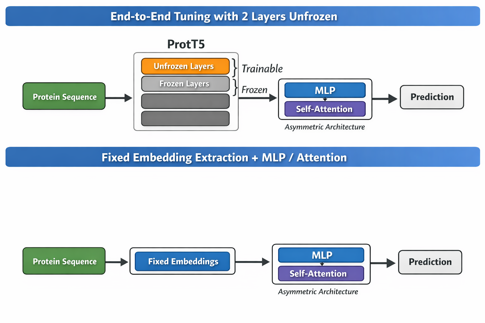
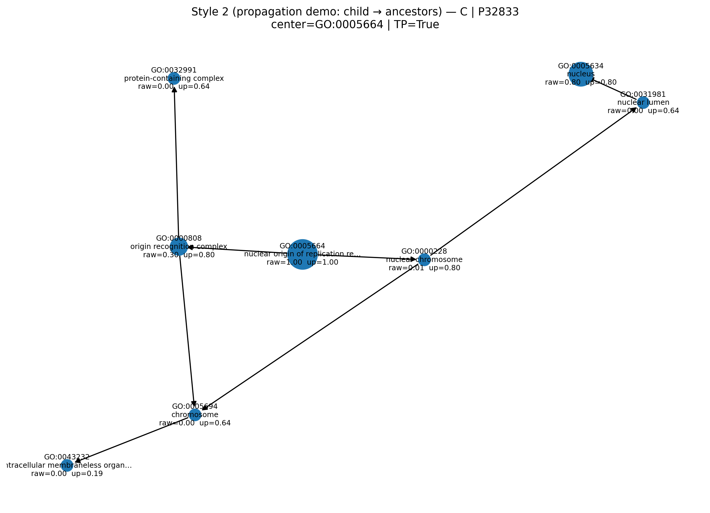

# Protein Function Prediction (CAFA-6)

## Overview

## Exploratory Data Analysis

**Figure 1.** 

### Machine Learning Models

### Training models on fixed embeddings vs. end-to-end transformer fine-tuning

### Training on rare labels vs. main training body

  
  
  

  
  
  

  
<em>
Figure 2. Diagnostic comparison across three validation cases.
</em>

### Aggregation

### GO-DAG propagation

  
  

### Denoising strategy

## Diagnostics

**Figure 2.** Style-1 plot: center-term confidence with ancestor structure.

**Figure 3.** Style-2 plot: probability distribution vs true-term density.

## Interpretation

## Summary and Outlook
